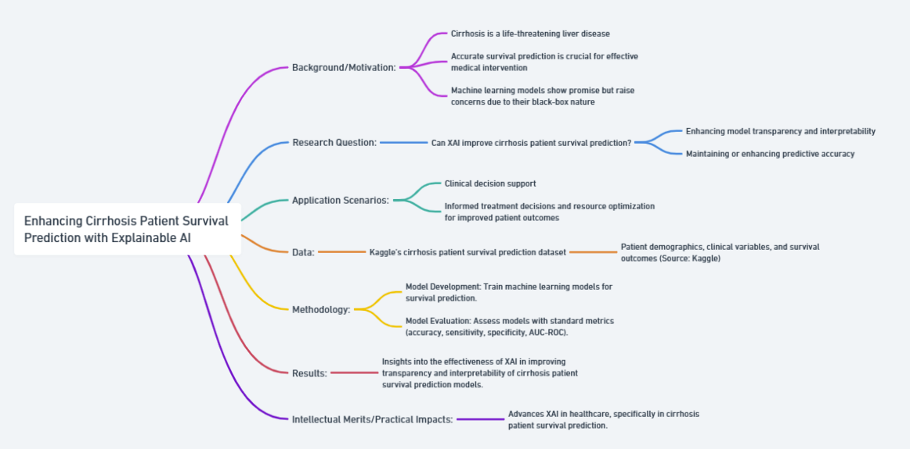
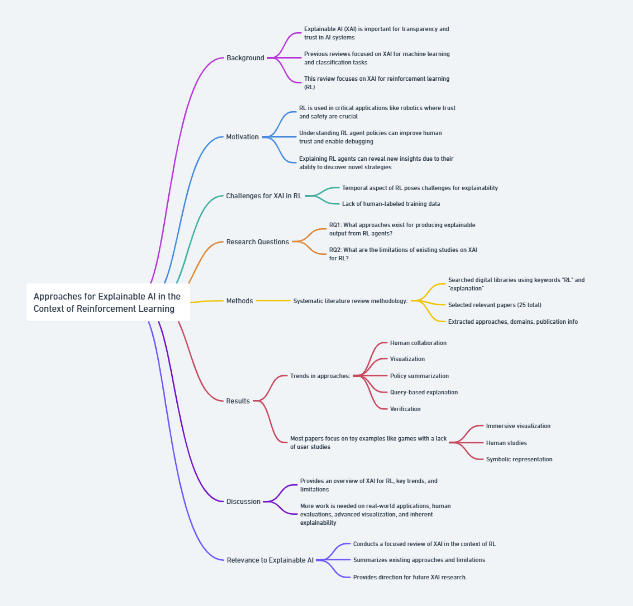

# Part I
## Background:

- Sheu et al. (2022) provides a survey on medical XAI, focusing on recent progress, explainability approaches, human interaction, and scoring systems.
Medical XAI is important for understanding decisions and results from AI systems in healthcare, improving transparency and trust.
Motivation:

- Laws and ethics require explainability in high-impact medical AI applications. The "right to explanation" is enshrined in laws like GDPR.
XAI enables oversight, auditing, and human control over automated medical decisions. This is crucial for patient safety and accountability.
## Research Questions:

- What are the latest XAI methods and how can they be applied in healthcare?
- How to design effective XAI systems that provide meaningful explanations to humans?
- How to evaluate and quantify explainability?
## Methods:

- The paper systematically reviews recent literature on medical XAI applications including pneumonia, sepsis, AKI, etc.
- It summarizes key XAI techniques for data preprocessing, algorithms, evaluation.
- It proposes a novel XAI Recommendation System and XAI Scoring System.
## Results:

- Identified major XAI methods: attention mechanisms, knowledge distillation, surrogate models, feature importance techniques.
- Reviewed medical use cases and how XAI was applied.
- Presented characteristics of effective medical XAI systems.
- Proposed recommendation and scoring systems to improve XAI.
## XAI Relation:

- This comprehensive survey summarizes the state-of-the-art in medical XAI.
- It highlights the importance of explainability in high-stakes healthcare applications.
- The proposed recommendation and scoring systems aim to advance XAI capabilities.
- Overall, the paper demonstrates how XAI can enable trustworthy AI in medicine.
## Flowchart

# Part II
## Background/Motivation:
- Heart failure is a prevalent and life-threatening condition associated with significant mortality rates, underscoring the importance of accurate survival prediction for effective medical management (Wrazen et al. 2023). Machine learning models have demonstrated potential in predicting patient outcomes (Wrazen et al. 2023). However, the opaque nature of these models has raised concerns regarding their applicability in clinical settings (Aghamohammadi et al. 2019). To address this challenge, the field of Explainable Artificial Intelligence (XAI) has emerged, aiming to develop models that are transparent and interpretable for clinicians, providing insights into the prediction process (Aghamohammadi et al. 2019).

## Research Question:
- This research seeks to explore how XAI techniques can enhance heart failure patient survival prediction by developing interpretable models. Specifically, the study aims to answer the following research question: "Can the integration of XAI techniques improve the transparency and interpretability of heart failure patient survival prediction models while maintaining or enhancing predictive accuracy?"

## Application Scenarios:
- The proposed research has broad applications in clinical decision support for heart failure. Successful implementation can assist healthcare professionals in making informed decisions about treatment strategies and resource allocation, ultimately leading to improved patient outcomes and more efficient resource utilization.

## Data:
- The research will utilize the heart failure patient survival prediction dataset from a reliable source, incorporating patient demographics, clinical variables, and survival outcomes. This dataset will serve as the foundation for developing and evaluating machine learning models.

## Methodology:
- Model Development: Train machine learning models for heart failure survival prediction.

- Model Evaluation: Assess model performance using standard metrics such as accuracy, sensitivity, specificity, and area under the ROC curve. Evaluate XAI models based on their interpretability.

## Results:
- The research aims to provide insights into the effectiveness of XAI techniques in improving the transparency and interpretability of heart failure patient survival prediction models. Results will encompass quantitative model performance metrics and qualitative assessments of model interpretability.

## Intellectual Merits/Practical Impacts:
The intellectual merits of this research lie in advancing XAI techniques in the healthcare domain, particularly for heart failure patient survival prediction. Enhanced model interpretability can empower healthcare professionals to make more informed and reliable decisions, potentially leading to improved patient outcomes.
## Flowchart
- 
## Citation
- Wrazen, Weronika, Kordian Gontarska, Felix Grzelka, and Andreas Polze. "Explainable AI for Medical Event Prediction for Heart Failure Patients." In International Conference on Artificial Intelligence in Medicine, pp. 97-107. Cham: Springer Nature Switzerland, 2023.
# Citations
```
@inproceedings{wrazen2023explainable,
  title={Explainable AI for Medical Event Prediction for Heart Failure Patients},
  author={Wrazen, Weronika and Gontarska, Kordian and Grzelka, Felix and Polze, Andreas},
  booktitle={International Conference on Artificial Intelligence in Medicine},
  pages={97--107},
  year={2023},
  organization={Springer}
}
@inproceedings{aghamohammadi2019predicting,
  title={Predicting heart attack through explainable artificial intelligence},
  author={Aghamohammadi, Mehrdad and Madan, Manvi and Hong, Jung Ki and Watson, Ian},
  booktitle={Computational Science--ICCS 2019: 19th International Conference, Faro, Portugal, June 12--14, 2019, Proceedings, Part II 19},
  pages={633--645},
  year={2019},
  organization={Springer}
}
```
